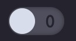

# CSS Switch
Simple CSS3 Switch using only HTML and CSS
Uses checkbox HTML input element
Includes nice smooth animation as well
Uses **1** and **0** for on and off

Feel free to use in your projects.  I created this as a experiement to give me access to a switch I can use in my projects.  Feel free to use.

## Example
Gif Example

Default Switch

Active Switch

## Contributing
If you want to help improve it, feel free to create a pull request. 

If you find an issue please add it to issues!  

Thanks! :D

